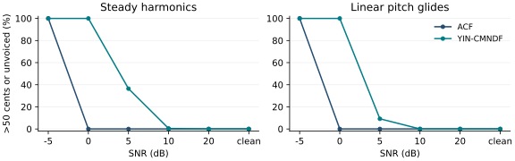

# F0 先導實驗：資訊可用時間、精度與運算成本

本實驗直接呼叫 `StreamPSOLA._detect_period`，比較既有 ACF 與獨立
YIN-CMNDF 基準。音訊引擎的預設演算法維持原設定，研究腳本獨立執行。
本次評測為合成訊號的逐窗 F0 估測，未量測硬體 loopback、真人語音、
完整變聲輸出品質，也未測試新的自適應窗策略。

## 可重現設定

```bash
python -m pip install -e '.[dev,benchmark]'
python benchmarks/benchmark_f0.py --seeds 10 --windows-ms 30 40 60
python -m pytest -q
```

- 取樣率 44,100 Hz；hop 20 ms；窗長 30、40、60 ms。
- 搜尋範圍 70-300 Hz；固定 F0 80、110、160、220、280 Hz。
- 線性滑音為 1.2 秒內 80 到 280 Hz，及反向 280 到 80 Hz。
- 八個振幅為 1/k 的諧波；整段訊號 RMS 正規化為 0.1。
- 白雜訊 SNR -5、0、5、10、20 dB，以及無雜訊；SNR 以整段能量定義。
- 十組種子 0-9；每段 49 窗；另測 RMS 0.1 的白雜訊及靜音。
- 完整輸出有 129,360 列方法-窗觀測，涵蓋兩種方法與三種窗長。
  這些重疊窗具有相關性，不當作獨立試驗樣本或推論顯著性的依據。
- 每一對方法使用完全相同的輸入窗，真值時間戳為窗中心。分析前視約為
  15、20、30 ms；這些值不代表 PSOLA 或裝置的端到端延遲。

`frames.csv` 保存逐窗結果，`summary.json` 保存分組結果與執行環境；
機器、套件版本與兩個程式 SHA-256 均記錄於 metadata。
逐窗 CSV 可由上述命令重建；Git 保留摘要與圖表。

## 方法與指標

ACF 原樣呼叫既有偵測器，包含去均值、RMS 門檻、整數 lag 與
`corr[peak] > 0.3 * corr[0]` 的有聲判定。此評測不加入 PSOLA 的週期平滑。

YIN-CMNDF 實作固定比較長度的平方差、累積均值正規化、第一個低於
0.1 的谷值與拋物線插值；無符合谷值時取全域最小值。有聲判定另外採
CMNDF < 0.3，並共用 RMS 0.005 門檻。它不包含原論文 step 6 的時間鄰域
搜尋，不宣稱等同所有 YIN 套件或整套原始演算法。FFT 用於加速平方差。
與 ACF 的整數 lag、正規化及有聲門檻不同，結果須以此具體實作解讀。

兩者看到相同輸入範圍；YIN 固定比較長度的有效配對中心隨 lag 變動。
滑音數據因而包含有效時間對齊的影響，後續需以中心對齊的平方差與
獨立開發集校準有聲門檻，分離窗位、插值、門檻與方法本身的貢獻。

- cents 誤差：1200 log2(估測 F0 / 真值 F0)。中位數和 p95 以真值有聲、
  且方法判定有聲的窗計算，與檢出率一起報告。
- `error_over_50c_or_miss`：真值有聲窗中，絕對誤差 >50 cents 或被判無聲
  的比例；不刪除無聲判定來美化音高表現。
- `voiced_miss_rate` 與 `unvoiced_false_alarm` 分別報告。
- RTF 為估測器總計算時間 / (評估窗數 × hop)，不包含合成資料、圖表、
  PSOLA 合成及裝置 I/O；運算時間依執行主機而變動。

## 結果與研究洞見



40 ms、20 dB 固定基頻切片（每方法 2,450 窗）的結果如下：

| 方法 | 絕對誤差中位數 | p95 | 有聲漏判率 | RTF |
|---|---:|---:|---:|---:|
| ACF | 3.930 cents | 7.081 cents | 0% | 0.01991 |
| YIN-CMNDF | 0.563 cents | 2.037 cents | 0% | 0.00913 |

在相同切片，YIN-CMNDF 的中位數隨 30/40/60 ms 窗長為
0.672/0.563/0.429 cents，ACF 三種窗長皆約 3.930 cents。
這提供分析插值精度、觀測長度與計算量的起點。

完整掃描也界定具體的條件邊界：在 -5 dB，40 ms 的兩個方法均把有聲
合成資料判為無聲；在 0 dB，該 YIN 有聲門檻也拒絕所有有聲窗；在 5 dB，
YIN-CMNDF 會出現週期倍數選擇。這些結果顯示有聲門檻、噪聲、窗位與
基頻估測應聯合評估。禁止將一個高 SNR 切片推論為真人語音或全 SNR 優勢。

下一階段將固定前視預算，加入因果或非對稱窗、多解析度 STFT 對照，
並以獨立語音及雜訊資料檢查精度-延遲-運算量的邊界。自適應選窗與
學習式選窗尚屬研究假設。

## Loopback 量測

本次沒有硬體 loopback 實測值。45 ms 是程式前視設定；1024/44100 秒
是區塊時間；兩者相加約 68.2 ms，不能當成整體延遲或量測上限。

1. 在目標電腦固定取樣率、block、輸入/輸出裝置、驅動和虛擬音訊路由。
2. 使用同一錄音時鐘同步錄下來源端參考與返回端輸出兩個聲道，明確記錄
   兩個取樣點。可用短非週期探測訊號；量測基本路由時關閉移調、共振峰、
   混響與音量閘，另量測啟用處理後的時間包絡，避免把波形變化當成延遲。
3. 每個設定至少錄製十次，保留 WAV 與設定；報告兩個取樣點之間的
   p50/p95 延遲。依接線範圍說明是否涵蓋 ADC/DAC、系統緩衝及完整處理鏈。
4. 分析同步雙聲道 WAV：

```bash
python benchmarks/analyze_loopback.py capture.wav --output capture-latency.json
```

輸出相關峰位置、相關係數、搜尋邊界旗標；低相關與邊界峰需檢視波形，
不能直接作為可信延遲。移調後訊號應另設計包絡或特徵對齊實驗。

## 參考資料

- A. de Cheveigné and H. Kawahara, "YIN, a fundamental frequency estimator
  for speech and music," JASA 111(4), 2002. https://doi.org/10.1121/1.1458024
- J.-C. Cheng and J.-J. Ding, adaptive time-frequency windowed synchroextracting
  transform with a reliable window-width region, EURASIP JASP 2026:14.
  https://doi.org/10.1186/s13634-025-01287-8
